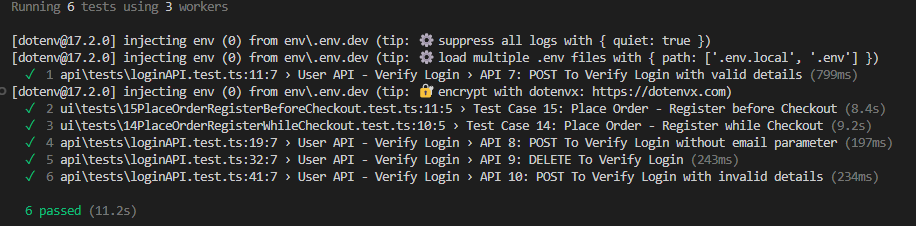

# playwright-ts-automation-exercise
Practice project for UI &amp; API test automation using Playwright in TypeScript, with a modern test structure, Page Object Model (POM), dynamic test data, and GitHub Actions CI integration.

## Project Structure (Maintainable & Scalable)

project-root/
├── .husky/
├── .vscode/
├── configs/
│   └── test.config.ts
├── env/
│   ├── .env.dev
│   └── .env.test
├── playwright.config.ts
├── src/
│   ├── pages/      <-- Page Object Model files
│   ├── tests/      <-- All tests
│   ├── utils/      <-- helpers (e.g. faker, api, env utils)
│   └── hooks/      <-- interceptors, global setup, etc.
├── .eslintrc.js
├── package.json
├── tsconfig.json
├── GETTING_STARTED.md
├── ISSUES.md
└── FEEDBACK.md

## Run Playwright Rests 

To run Playwright UI and API tests in headless mode

ENV=dev npx playwright test

To run Playwright API tests 

`ENV=dev npx playwright test api/*`

To run Playwright UI tests in headed mode, where you can visually observe the browser as it interacts with your app, just add the --headed flag to your test command:

ENV=dev npx playwright test ui/* --headed

🎯 What this does:
- Launches the browser with a visible UI (instead of running headless).
- Useful for debugging or observing animations, UI transitions, and dynamic behaviors.

🔧 Bonus: Combine with `--debug` for supercharged inspection

ENV=dev npx playwright test ui/* --headed --debug

This opens the [Playwright Inspector]("https://playwright.dev/docs/debug") so you can pause, step through, and review each action interactively.
Let me know if you're running a specific test file or need to control viewport, browser type, or tracing—happy to help you fine-tune it!

🧠 Timeout Scopes in Playwright
| Context | Timeout Source | Default | 
| Test as a whole | timeout in defineConfig or test.setTimeout() | 30000ms | 
| Locator actions (click, fill, etc) | page.setDefaultTimeout() | 30000ms | 
| Assertions like expect().toBeVisible() | Needs its own explicit timeout | 5000ms | 

Playwright allows you to set a global timeout and expect timeout in your config

