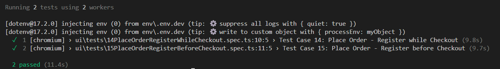
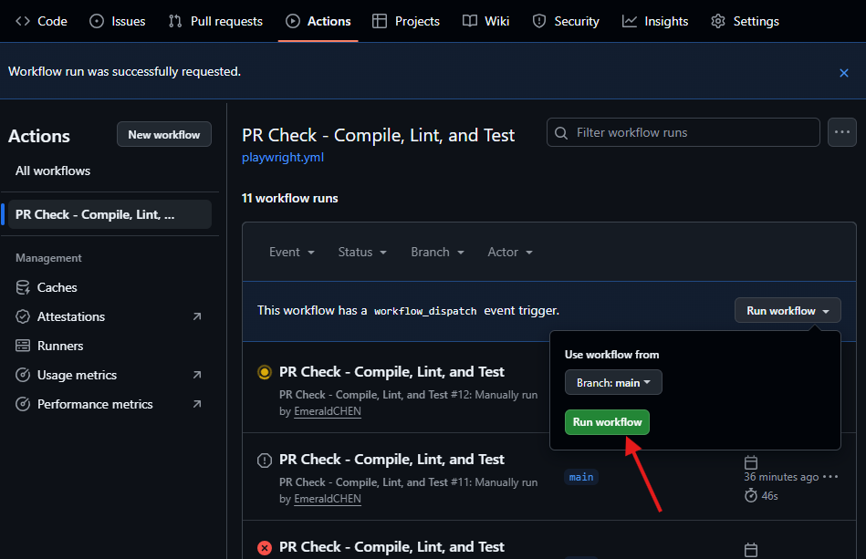

# Getting Started

## Purpose

This document provides step-by-step instructions for setting up, running, and maintaining Playwright tests.

## Getting the Latest Code

- If you have not cloned the repo yet: Open terminal (VSCode terminal, Command Prompt, Git Bash, etc.) to follow steps on "How to deploy it locally" i

- If you already cloned the repo: 

1) Open terminal inside your project folder to get the latest changes from GitHub:

```ts
cd path/to/playwright-github-repo
```

2) Pull the latest code from the main branch of the remote GitHub repository by running:

```ts
git pull origin main
```

✅ Optional: 

1) Check Branch or Switch

- If you're working on a feature branch, check or switch:

```ts
git branch         # See current branch
git fetch          # Update remote info
git checkout main  # Switch to the main branch
```

2) Finish your branch work → switch to `main` → merge → push

- If you complete work in a feature branch, move back to `main`, merge your changes, and push them so they're reflected remotely

```ts
git checkout main    
git merge [branch]    
git push origin main  
```

## How to deploy it locally

✅ Prerequisites

- Make sure you have the following installed:

- Node.js (v18+ recommended, see [Node.js](https://nodejs.org/en))

- npm (comes with Node.js)

- Optional: Git (see [Git](https://git-scm.com/downloads))

🛠️ Steps to Run Locally

1. Clone the Repository

```ts
git clone https://github.com/EmeraldCHEN/playwright-github-actions.git
cd playwright-github-actions
```

2. Install Dependencies

```ts
npm install
```

3. Check Playwright Installation

```ts
npx playwright install
```

## Running the Tests Locally

  - To run UI and API tests in headless mode
  
  ```ts
  ENV=dev npx playwright test
  ```

  or 

  ```ts
  npx playwright test
  ```

 


  - To run UI tests for a specific browser, e.g. Chromium

  ```ts
  ENV=dev npx playwright test ui/* --project=chromium
  ```

  
  

  
  - To run API tests in `dev` environment using `Git Bash`
  
  ```ts
  ENV=dev npx playwright test api/*
  ```

  - To run API tests in `dev` environment using `PowerShell` or the Windows Command Prompt, 
  
  ```ts
  $env:ENV="dev"
  npx playwright test api/*
  ```

  - To run a specific test file
  
  ```ts
  npx playwright test tests/example.test.ts
  ```
  
  - To run UI tests in headed mode, where you can visually observe the browser as it interacts with your app, just add the --headed flag to your test command:
  
  ```ts
  npx playwright test ui/* --headed
  ```
  
  🎯 What this does:
  - Launches the browser with a visible UI (instead of running headless)
  - Useful for debugging or observing animations, UI transitions, and dynamic behaviors
  
  🔧 Bonus: Combine with `--debug` for supercharged inspection
  
  ```ts
  ENV=dev npx playwright test ui/* --headed --debug
  ```
  
  - This opens the [Playwright Inspector](https://playwright.dev/docs/debug) so you can pause, step through, and review each action interactively.

  - To run UI tests in UI mode

  ```ts
  npx playwright test ui/* --ui
  ```

  ✅ To manually trigger tests by dispatching a workflow in GitHub Actions

    - Go to [GitHub Actions](https://github.com/EmeraldCHEN/playwright-ts-automation-exercise/actions/workflows/playwright.yml)

    - Click the Run workflow button and select a feature branch if you don’t want to run it on the main branch

    

    - Can cancel the test run if needed

    
<!-- 
  // Skip running `npm run lint` for now
  
  🔍 Lint code with ESLint

  - Run:

  ```ts
  npm run lint:fix
  ```

  This will scan all `.ts` files and automatically apply safe fixes where possible (like indentation, spacing, missing semicolons, etc). -->


  🧪 Using `.only()` for specific test(s), e.g.

  ```ts
  test.only('runs just this test', async () => {
    // Test logic here
  });

  test.only('another exclusive test', async () => {
    // Also runs if marked with .only
  });
  ```

  🧪 Optional: Open HTML Report

  - After running tests:

  ```ts 
  npx playwright show-report
  ```
  
  - See more details on [Reporters](https://playwright.dev/docs/test-reporters)


  ✅ Update Dependencies in Playwright project with TypeScript & npm

  - Update project dependencies via `npm update` or manually adjusted versions in [`package.json`](https://github.com/EmeraldCHEN/playwright-ts-automation-exercise/blob/main/package.json)

  - Ensured compatibility with latest Playwright, TypeScript, and ESLint versions

  - Ran `npx playwright install` to ensure browser binaries are up to date

  - Verify test execution and linting work as expected


  ✅ `.gitignore` Best Practices Summary

  - Ensure `.gitignore` file is placed at the root level if you want it applied globally

  - Make sure there's no accidental whitespace or file extension (`.node_modules`, for example), and double check to ensure it's correct `.gitignore` syntax
  
  - If `node_modules/` or other files are listed in your `.gitignore` file but it's still showing up in your GitHub repo, it might be because Git doesn't automatically untrack files that were added before before ignored. You can fremoves the folder from Git tracking. E.g. `node_modules/` would disappear from GitHub if you run:

  ```ts 
  git rm -r --cached node_modules/
  git commit -m "Remove node_modules from repo"
  git push origin [branch]
  ```

  - 📚 More Resources
  
  - [Test generator](https://playwright.dev/docs/codegen)

  - [Page object models](https://playwright.dev/docs/pom)

  - [API testing](https://playwright.dev/docs/api-testing)
 
  - [Setting up CI](https://playwright.dev/docs/ci-intro)

  - [Parallelism](https://playwright.dev/docs/test-parallel)

  - [UI Mode](https://playwright.dev/docs/test-ui-mode)

  - [TypeScript](https://playwright.dev/docs/test-typescript)


---

## Links

[README](https://github.com/EmeraldCHEN/playwright-ts-automation-exercise/blob/main/README.md) | [EXERCISE](EXERCISE.md) |  | [ISSUES](https://github.com/EmeraldCHEN/playwright-ts-automation-exercise/blob/main/wiki/Issues.md)
