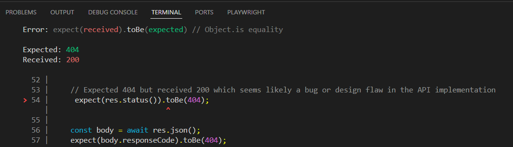

## Documented Issues

- Issue 1:
  - Description: 
  
  The login API endpoint returns HTTP status code 200 `OK` when required parameters (email or password) are missing or invalid login details. However, the response body correctly contains an error with responseCode: 400/404/405 and an appropriate message. This is very likely a bug or design flaw in the API implementation.
  
  - Found during the automated API tests, see comments in [API Testing - Verify Login - API 8/9/10](https://github.com/EmeraldCHEN/playwright-ts-automation-exercise/blob/main/api/tests/verifyLogin.spec.ts)
  
  - Reproducible:Yes

    - Steps to Reproduce: Comment out line 25, 37 and 54 in [API Testing - Verify Login - API 8/9/10](https://github.com/EmeraldCHEN/playwright-ts-automation-exercise/blob/main/api/tests/verifyLogin.spec.ts), then run the API tests
   
    